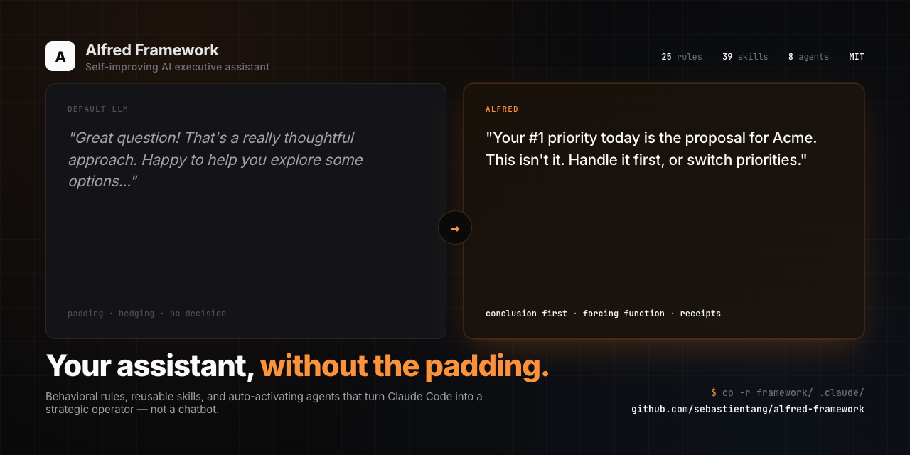

<p align="center">
  
</p>

# Alfred Framework

A framework for building self-improving AI executive assistants with Claude Code.

## What This Is

Alfred Framework is a structured methodology for turning Claude Code into an executive assistant that manages your pipeline, enforces accountability, detects your avoidance patterns, and improves itself over time. It's not a library — it's a set of behavioral rules, reusable skills, auto-activating agents, and self-optimization systems that make Claude Code operate as a strategic partner rather than a chatbot.

This framework was extracted from a production system that manages a freelance consulting business: daily briefings, pipeline tracking, outreach drafting, proposal generation, meeting prep, and weekly reviews — all with dual logging to both CRM and local files.

## Key Concepts

### Rules (the brain)
Three files define how your assistant thinks:
- **`behavior.md`** — 25 behavioral rules covering priority enforcement, brutal honesty, pattern recognition, decision forcing, avoidance detection, session management, context capture, knowledge synthesis routing, reply-vs-outreach separation, pre-draft context pulls, candidate-perspective gates, timezone math, and voice pre-scanning
- **`voice.md`** — Communication style: brevity over completeness, specifics over generalities, deadlines over intentions. Includes a pre-scan gate for user-submitted drafts and a 38-word banned list.
- **`self-optimization.md`** — 10 systems for continuous improvement: component creation (3-time rule), template evolution, relationship decay detection, time allocation analysis, stale data detection, and context window management

### Skills (user-invoked workflows)
Multi-step procedures triggered by `/skill-name`. Each skill is a self-contained markdown file with numbered steps. 39 skills included — from daily briefings to adversarial decision debates to channel-aware reply drafting.

### Agents (auto-activating experts)
Domain specialists that activate when context matches — no explicit trigger needed. 8 agents included — from Astro site building to Korean business etiquette.

### Templates (structured output)
Markdown templates for recurring outputs (briefings, proposals, reviews). The assistant fills the template — the user reviews and acts.

### Self-Optimization
The system improves itself:
- **3-Time Rule** — after doing the same task 3 times manually, propose creating a skill/agent
- **Template Evolution** — rotating weekly feedback questions → template updates after 4 data points
- **Outreach Intelligence** — after 15+ entries, recommend angles, channels, and timing
- **Time Allocation Analysis** — track category drift, escalate when priorities are misaligned
- **Relationship Decay** — compute reactivation scores, surface overdue contacts
- **Stale Data Detection** — flag tracking files past freshness thresholds

## Quick Start

1. Copy `framework/` into your project's `.claude/` directory:
```bash
cp -r framework/rules/ .claude/rules/
cp -r framework/conventions/ .claude/conventions/
cp -r framework/templates/ templates/
```

2. Copy skills and agents you want:
```bash
# Copy all skills
cp -r skills/ .claude/skills/

# Copy all agents
cp -r agents/ .claude/agents/

# Or pick individually
cp -r skills/briefing/ .claude/skills/briefing/
cp -r agents/deal-closing-expert/ .claude/agents/deal-closing-expert/
```

3. Create your `CLAUDE.md` using `examples/freelance-consultant/CLAUDE.md` as a starting point. Customize:
   - Your context (who you are, what matters)
   - Your top priority
   - Your trigger table (what commands you want)
   - Your decision framework

4. Replace `[PLACEHOLDERS]` in copied skills with your actual values:
   - `[YOUR_RATE]` → your daily rate
   - `[YOUR_CITY]` → your location
   - `[YOUR_TIMEZONE]` → your timezone (e.g., "America/New_York")
   - `[YOUR_ROLE]` → your professional role
   - `[YOUR_MARKET]` → your target market
   - `[BURN_RATE]` → your monthly expenses
   - `[HEALTH_TRACKER]` → your wearable (Oura, Whoop, etc.)
   - `[STUDY_APP]` → your learning app

5. Start a Claude Code session. The assistant will read your rules and operate accordingly.

## Project Structure

```
alfred-framework/
├── framework/
│   ├── rules/                    # Core behavioral rules
│   │   ├── behavior.md           # 25 behavioral rules
│   │   ├── voice.md              # Communication style + pre-scan gate + banned words
│   │   └── self-optimization.md  # 10 self-improvement systems
│   ├── references/
│   │   └── wiki/                 # Knowledge synthesis layer (5 template pages)
│   ├── conventions/
│   │   └── skill-agent-conventions.md
│   ├── templates/                # Output templates
│   └── structure.md
├── skills/                       # All 39 skills
│   ├── briefing/SKILL.md
│   ├── weekly-review/SKILL.md
│   ├── debrief/SKILL.md
│   ├── proposal/SKILL.md
│   ├── ... (35 total)
│   └── x-post/SKILL.md
├── agents/                       # All 8 agents
│   ├── deal-closing-expert/AGENT.md
│   ├── korean-business-expert/AGENT.md
│   ├── ... (8 total)
│   └── pipeline-math-expert/AGENT.md
├── examples/
│   └── freelance-consultant/
│       ├── CLAUDE.md             # Example project config
│       └── templates/            # Example filled templates
├── docs/
│   └── getting-started.md
├── README.md
├── LICENSE
└── .gitignore
```

## Skills (39)

### Business Operations
| Skill | What it does |
|-------|-------------|
| `briefing` | Daily morning briefing — pipeline, tasks, calendar, frog selection, reactivation scan |
| `weekly-review` | Weekly stats, retrospective, accountability checks, pattern analysis, self-assessment |
| `weekend-briefing` | Lightweight non-revenue briefing for weekends — build tasks, carry-forward |
| `quarterly-retro` | Quarterly retrospective — goal scorecard, learning analysis, STOP/START/CONTINUE |
| `closeout` | Session closeout — carry-forward items, tracking updates, commit and push |
| `system-health` | Dashboard — file freshness, self-optimization status, nag counters |
| `financial-health` | Income, pipeline-weighted forecast, burn rate, runway calculation |
| `note` | Frictionless context capture — timestamped append to context-updates.md |
| `context-refresh` | Monthly maintenance — apply context updates, archive processed, freshness audit |

### Pipeline & Outreach
| Skill | What it does |
|-------|-------------|
| `outreach` | Draft outreach message — contact lookup, angle selection, voice-checked draft |
| `reply` | Fast reply drafter for active threads — channel- and length-aware, hard word cap, no pipeline ceremony |
| `meeting-prep` | Meeting preparation — CRM context, email/calendar history, discovery questions |
| `debrief` | Post-interaction capture — 5 questions, CRM update, next action with deadline |
| `proposal` | Business proposal — challenge-led format, rate tiers, scope structure |
| `outreach-intelligence` | Outreach analytics — angle performance, channel conversion, timing optimization |
| `tailor-cv` | ATS-optimized CV — job description parsing, auto language detection, HTML output |

### Content & Social
| Skill | What it does |
|-------|-------------|
| `linkedin-post` | LinkedIn post — anti-AI voice rules, 900-1300 chars, French default |
| `x-post` | X/Twitter post — 280-char limit, contrarian voice, English only |
| `linkedin-engage` | LinkedIn engagement — parse digest, score relevance, draft comments |
| `brand-voice-check` | Content validation — regex + AI two-pass, tier-aware, bilingual |
| `humanizer` | Remove AI-writing patterns from text (Wikipedia's "Signs of AI writing" guide) |
| `prose-fr` | French proofreader — accents, AI patterns in French, grammar (accord, subjonctif, COD) |
| `refresh-keyword-queue` | SEO keyword generation — validate against existing articles |

### Decision Making
| Skill | What it does |
|-------|-------------|
| `council` | Adversarial decision debate — 4-agent team (Proposer, Challenger, Steelmanner, Pre-Mortem) |
| `war-room` | Proposal stress-test — 4-agent team (Buyer's Advocate, Competitor Shadow, Scope Realist, Pricing Challenger) |
| `arch-review` | Architecture review — 4-agent team (Pragmatist, Scale Thinker, DX Advocate, Debt Accountant) |
| `ship-gate` | Release readiness — 4-agent team (Secret Hunter, Doc Judge, Dependency Auditor, First Impression Tester) |

### Research & Knowledge
| Skill | What it does |
|-------|-------------|
| `deep-research` | Multi-model Perplexity research — auto model selection, structured reference output |
| `generate-expert-agent` | Create auto-activating agent from a deep-research reference file |

### Development & Deployment
| Skill | What it does |
|-------|-------------|
| `scaffold-astro` | Scaffold Astro 5.x + Tailwind v4 project with layouts, components, config |
| `deploy-cloudflare` | Build and deploy to Cloudflare Pages via wrangler |
| `setup-content-pipeline` | Blog automation — article generation, validation, keyword queue, GitHub Actions cron |
| `setup-auto-fix` | GitHub Actions workflows for autonomous CI auto-fix with Claude Code |
| `audit-project` | 11-domain project audit — structure, config, content, SEO, security, performance |

### Session Management
| Skill | What it does |
|-------|-------------|
| `wrap-conversation` | Extract learnings from current conversation to global resources |
| `wrap-project` | Survey project, extract cross-project patterns, consolidate memory |
| `handoff` | Pre-`/clear` dev-session summary — chat-only, absolute paths, background process IDs preserved |

### Creative Tools
| Skill | What it does |
|-------|-------------|
| `excalidraw-visuals` | Hand-drawn style PNG diagrams via Excalidraw/kie.ai API |
| `nano-banana-images` | Hyper-realistic image generation via Nano Banana 2 (Gemini) |

## Agents (8)

| Agent | When it activates | What it does |
|-------|-------------------|-------------|
| `astro-site-builder` | Creating Astro pages, components, or layouts | Follows layout hierarchy, Tailwind v4 @theme patterns, content collections |
| `content-pipeline-builder` | Setting up blog automation, content generation | API retry patterns, Zod validation, GitHub Actions workflows |
| `article-reviewer` | Reviewing blog articles in content collections | Voice compliance, ICP relevance, GEO optimization, terminology accuracy |
| `deal-closing-expert` | Sales calls, objection handling, negotiation | SPIN, Challenger, LAER frameworks, buying signal analysis |
| `korean-business-expert` | Korean business interactions, KakaoTalk | Hierarchy dynamics, nunchi decoder, cultural conversion funnel |
| `french-si-market-expert` | French ESN/SI interactions, consulting platforms | Margin model transparency, platform ladder strategy, payment cycles |
| `freelance-pricing-expert` | Rate setting, packaging, value-based pricing | TJM benchmarks, three-tier packaging, SI margin calculation |
| `pipeline-math-expert` | Pipeline health, forecasting, conversion rates | Probability-weighted forecasting, velocity formula, deal aging |

## Philosophy

**Rules over prompts.** A well-defined behavioral rule ("If the user asks to work on something that's not their top priority, checkpoint them") produces better results than a vague instruction ("be helpful and keep the user focused"). Rules are testable, debuggable, and composable.

**Skills over memory.** Instead of hoping the AI remembers your preferred workflow, encode it as a numbered procedure. Skills are deterministic — they run the same way every time, across sessions.

**Self-optimization over manual tuning.** The system proposes its own improvements. After 3 repeated tasks → suggests a new skill. After 15 outreach entries → recommends the best-performing angle. After 2 weeks of priority drift → escalates. You approve or reject — the system doesn't change itself without permission.

**Load on demand.** Not every file needs to be in context every session. Define a trigger-to-file mapping in CLAUDE.md so the assistant loads what it needs, when it needs it. This is how you scale to 30+ reference files without blowing the context window.

**Track everything, archive aggressively.** Dual-log to both structured systems (CRM) and local markdown. Archive processed entries monthly. Never archive wins.

## License

MIT — see [LICENSE](LICENSE).
